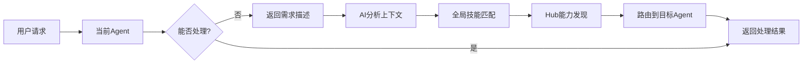

# AgentHub

一个现代化的智能代理(Agent)管理和发现系统，基于Go语言开发，支持技能驱动的服务发现、动态上下文分析和分布式代理协调。

## ✨ 特性

### 核心功能
- 🚀 **代理注册与发现** - 支持代理的动态注册和技能驱动的发现机制
- 🔍 **技能驱动发现** - 基于代理技能进行智能匹配和服务发现
- 🧠 **动态上下文分析** - AI驱动的智能需求分析和代理路由
- 🎯 **全局技能聚合** - 维护所有注册代理的统一技能索引
- 🏗️ **NamingServer集成** - 支持Seata NamingServer作为服务注册中心

### 系统特性
- 🔐 **JWT认证** - 内置JWT认证机制，支持可选认证模式
- 📊 **监控指标** - 内置Prometheus指标收集
- 🔄 **健康检查** - 自动代理健康检查和状态管理
- ⚙️ **灵活配置** - 支持YAML配置和环境变量覆盖
- 🏛️ **K8s模式** - 遵循Kubernetes设计模式和最佳实践

## 🧠 动态上下文分析

AgentHub的核心创新功能，当代理无法处理用户请求时，系统会自动：

1. **需求分析** - 使用AI分析用户的具体需求
2. **技能匹配** - 在全局技能库中寻找最匹配的能力
3. **智能路由** - 自动路由到最适合的代理服务
4. **无缝切换** - 为用户提供连续的服务体验



## 🏗️ 架构

```
AgentHub
├── cmd/                    # 应用程序入口
├── internal/               # 内部包
│   ├── app/               # 应用程序核心逻辑
│   ├── handlers/          # HTTP处理器
│   └── services/          # 业务服务层
│       ├── agent.go       # 代理管理服务
│       ├── context_analyzer.go  # 动态上下文分析器
│       └── ai_client.go   # AI服务客户端
├── pkg/                   # 可复用的包
│   ├── auth/              # JWT认证
│   ├── common/            # 通用工具
│   ├── config/            # 配置管理
│   ├── models/            # 数据模型
│   │   ├── agent.go       # Agent相关模型
│   │   └── context.go     # 上下文分析模型
│   ├── server/            # HTTP服务器
│   ├── storage/           # 存储抽象
│   │   ├── namingserver.go  # NamingServer集成
│   │   └── memory.go      # 内存存储
│   └── utils/             # 工具函数
└── tests/                 # 测试用例
```

**项目统计**：
- **5,882行** Go代码
- **30个** Go文件
- **完整的微服务架构**

## 📦 安装

### 预备条件

- Go 1.21+
- (可选) Seata NamingServer
- (可选) AI服务API密钥 (OpenAI/Anthropic)

### 构建

```bash
# 克隆仓库
git clone <repository-url>
cd agenthub

# 安装依赖
go mod tidy

# 构建
go build ./cmd/...

# 运行
./agenthub
```

## 🚀 快速开始

### 1. 启动服务

```bash
# 使用默认配置启动
./agenthub

# 或指定配置文件
./agenthub custom-config.yaml
```

### 2. 注册代理

```bash
curl -X POST http://localhost:8080/agent/register \
  -H "Content-Type: application/json" \
  -d '{
    "agent_card": {
      "name": "text-processor",
      "description": "专业文本处理代理",
      "url": "http://localhost:3000",
      "version": "1.0.0",
      "provider": {
        "organization": "AI-Corp",
        "url": "http://localhost:3000"
      },
      "skills": [
        {
          "id": "text-processing",
          "name": "文本处理",
          "description": "处理和分析文本内容，包括情感分析、关键词提取",
          "tags": ["nlp", "text", "analysis"]
        },
        {
          "id": "language-translation",
          "name": "语言翻译",
          "description": "多语言文本翻译服务",
          "tags": ["translation", "language"]
        }
      ]
    },
    "host": "localhost",
    "port": 3000
  }'
```

### 3. 传统技能发现

```bash
curl -X POST http://localhost:8080/agent/discover \
  -H "Content-Type: application/json" \
  -d '{
    "query": "text-processing"
  }'
```

### 4. 🆕 动态上下文分析

```bash
curl -X POST http://localhost:8080/agent/analyze-context \
  -H "Content-Type: application/json" \
  -d '{
    "need_description": "我需要分析这篇文章的情感倾向",
    "user_context": "用户正在处理社交媒体数据分析项目"
  }'
```

### 5. 查看全局技能库

```bash
curl http://localhost:8080/skills/global
```

## 🧠 动态上下文分析详解

### 工作原理

1. **全局技能聚合**
   - 每个代理注册时，技能自动添加到全局技能库
   - 维护 `skillID → agentURL` 的映射关系
   - 支持技能去重和更新

2. **AI驱动分析**
   ```go
   // AI分析接口
   type AIClient interface {
       AnalyzeContext(ctx context.Context, 
           needDescription string, 
           availableSkills []AgentSkill) (*SkillMatchQuery, error)
   }
   ```

3. **智能匹配算法**
   - 精确技能ID匹配：100分
   - 关键词匹配：50-30分
   - 标签匹配：20分
   - 自动排序选择最佳匹配

4. **Hub集成路由**
   - 获取匹配的技能ID
   - 调用Hub的能力发现接口
   - 返回完整的Agent信息和调用地址

### 使用示例

```go
// 在AgentService中启用动态上下文
agentService := services.NewAgentService(services.AgentServiceConfig{
    Storage:         storage,
    ContextAnalyzer: contextAnalyzer,  // 启用动态分析
})

// 检查是否启用
if agentService.IsContextAnalysisEnabled() {
    // 执行动态上下文分析
    response, err := agentService.AnalyzeContext(ctx, &models.ContextAnalysisRequest{
        NeedDescription: "我需要处理图片中的文字",
    })
}
```

## ⚙️ 配置

### 配置文件 (config.yaml)

```yaml
hub:
  id: "agent-hub-01"
  name: "AgentHub"
  version: "1.0.0"
  listen_address: ":8080"

# AI服务配置 (可选)
ai:
  provider: "openai"        # openai/anthropic/mock
  api_key: "sk-xxx"        # API密钥
  model: "gpt-4"           # 模型名称
  max_tokens: 1000         # 最大令牌数

seata:
  server_addr: "127.0.0.1:8091"
  namespace: "public"
  cluster: "default"
  heartbeat_period: 5000

# 动态上下文配置
context_analysis:
  enabled: true             # 是否启用动态上下文分析
  ai_provider: "mock"       # AI提供商: mock/openai/anthropic
  timeout: "30s"           # 分析超时时间
  max_skills: 50           # 最大技能匹配数

logging:
  level: "info"
  format: "json"
  output: "stdout"

metrics:
  listen_address: ":9090"
  enabled: true

auth:
  enabled: false
  jwt_secret: ""
  jwt_expiry: "24h"
  optional: false

storage:
  type: "namingserver"     # memory/namingserver
  options: {}

naming_server:
  enabled: true
  address: "127.0.0.1:8091"
  username: ""
  password: ""
```

## 🔌 API 接口

### 代理管理

| 方法 | 端点 | 描述 |
|------|------|------|
| POST | `/agent/register` | 注册代理 |
| POST | `/agent/discover` | 发现代理 |
| GET | `/agent/get?id={id}` | 获取代理 |
| GET | `/agents` | 列出所有代理 |
| PUT | `/agent/status?id={id}` | 更新代理状态 |
| DELETE | `/agent/remove?id={id}` | 移除代理 |
| POST | `/agent/heartbeat?id={id}` | 更新心跳 |

### 🆕 动态上下文分析

| 方法 | 端点 | 描述 |
|------|------|------|
| POST | `/agent/analyze-context` | 动态上下文分析和路由 |
| GET | `/skills/global` | 获取全局技能库 |
| GET | `/context/health` | 上下文分析器健康检查 |

### 系统接口

| 方法 | 端点 | 描述 |
|------|------|------|
| GET | `/health` | 健康检查 |
| GET | `/metrics` | Prometheus指标 |

### 认证接口 (auth.enabled = true)

| 方法 | 端点 | 描述 |
|------|------|------|
| POST | `/auth/token` | 生成Token |
| POST | `/auth/refresh` | 刷新Token |

## 🧪 测试

```bash
# 运行所有测试
go test ./...

# 运行特定测试
go test ./tests/

# 查看测试覆盖率
go test -cover ./...

# 测试动态上下文功能
go test ./internal/services -v -run TestContextAnalysis
```

## 📊 监控

### Prometheus指标

访问 `http://localhost:9090/metrics` 获取指标数据。

**新增指标**：
- `context_analysis_requests_total` - 上下文分析请求总数
- `context_analysis_success_total` - 分析成功总数
- `context_analysis_duration_seconds` - 分析耗时
- `skill_matches_total` - 技能匹配总数
- `ai_api_calls_total` - AI API调用总数

**原有指标**：
- `agent_registers_total` - 代理注册总数
- `agent_discovers_total` - 代理发现总数
- `auth_requests_total` - 认证请求总数

### 日志

```json
{
  "timestamp": "2025-08-23T22:30:00Z",
  "level": "INFO",
  "component": "context-analyzer",
  "message": "Successfully analyzed context and routed to agent",
  "need_description": "处理文本情感分析",
  "matched_skills": ["text-processing", "sentiment-analysis"],
  "target_agent": "text-processor-v1",
  "analysis_duration": "125ms"
}
```

## 🔧 开发

### 核心组件

1. **ContextAnalyzer** (`internal/services/context_analyzer.go`)
   - 动态上下文分析核心逻辑
   - AI服务集成接口
   - 技能匹配算法

2. **AIClient** (`internal/services/ai_client.go`)
   - AI服务抽象接口
   - Mock实现和真实AI集成
   - 提示词管理

3. **全局技能管理** (`pkg/storage/namingserver.go`)
   - 全局AgentCard维护
   - 技能聚合和去重
   - skillID到URL的映射

### 添加新AI提供商

1. 实现 `AIClient` 接口：
```go
type CustomAIClient struct {
    apiKey string
    baseURL string
}

func (c *CustomAIClient) AnalyzeContext(ctx context.Context, 
    needDescription string, 
    availableSkills []models.AgentSkill) (*models.SkillMatchQuery, error) {
    // 实现AI分析逻辑
}
```

2. 在配置中注册：
```yaml
ai:
  provider: "custom"
  api_key: "your-key"
```

### 自定义技能匹配算法

```go
// 实现自定义评分算法
func customSkillScore(skill models.AgentSkill, query *models.SkillMatchQuery) int {
    // 自定义评分逻辑
    return score
}
```

## 🚗 路线图

- [x] 基础代理注册和发现
- [x] 技能驱动的服务发现
- [x] 动态上下文分析架构
- [x] Mock AI集成和测试
- [ ] OpenAI/Anthropic真实AI集成
- [ ] 提示词优化和调试
- [ ] 代理调用结果缓存
- [ ] 分布式部署支持
- [ ] Web管理界面
- [ ] 更多AI服务提供商支持

## 📄 许可证

本项目采用 [MIT License](LICENSE) 许可证。

## 🤝 贡献

欢迎贡献代码！特别是：

- AI服务集成优化
- 提示词设计改进  
- 新的技能匹配算法
- 性能优化
- 测试覆盖率提升

### 贡献步骤

1. Fork本仓库
2. 创建特性分支 (`git checkout -b feature/dynamic-routing`)
3. 提交更改 (`git commit -m 'Add dynamic context routing'`)
4. 推送到分支 (`git push origin feature/dynamic-routing`)
5. 开启Pull Request

## 📞 支持

如有问题，请：

1. 查看[Wiki文档](wiki)
2. 搜索[Issues](issues)  
3. 提交新的[Issue](issues/new)
4. 加入讨论 [Discussions](discussions)

---

**AgentHub** - 智能代理管理的未来！🚀🧠

> 从简单的服务发现，到AI驱动的智能路由 - AgentHub让代理协作变得更加智能和高效。