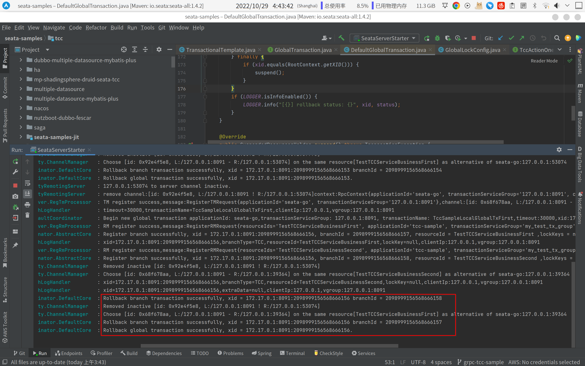

## 用例介绍
此用例介绍如何在tcc本地模式下使用事务传播特性，编排多个全局事务的传播关系

## 使用步骤

- 在``./sample/tcc/propagation/first/main.go``中修改 TestTCCServiceBusiness 的 Prepare 方法，在 WithGlobalTx 方法的配置参数 GtxConfig 设置传播性 Propagation，它将会影响第 second 全局事务如何处理 first 全局事务中传递来的 xid。其中 first 全局事务的传播性为默认值 Require。
- 启动``seata tc server``
- 使用以下命令运行用例``go run ./sample/tcc/propagation/first/main.go``

注意：sample 中设置的传播级别为 Mandatory，因此 second 会继承 first
 的 xid, 且在 second 的 prepare 方法中会抛出一个 error，预期的行为是 second 不执行回滚，first 执行回滚，同时将 second 中绑定的 branch 一起回滚

## 预期的 TC 日志

如图红色划线处，两个回滚成功的 branch 分别来自 first 和 second，回滚成功的 global transaction 来自 first